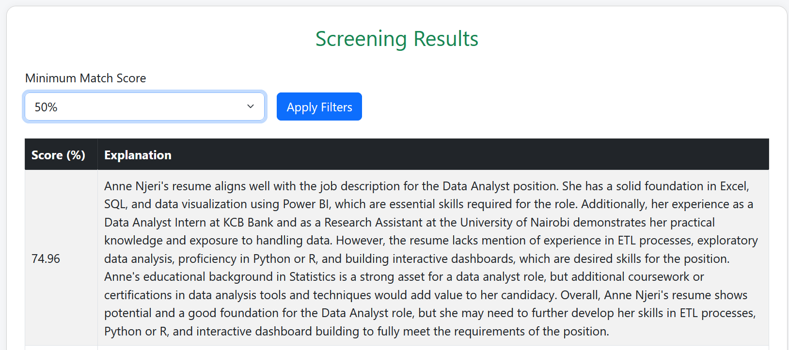

# AI Resume Screener

This is an AI-powered resume screening system built using Python, Flask, and SQLite. It uses OpenAI's language models and Sentence Transformers to semantically compare uploaded resumes against a given job description, calculate a match score, and generate a natural language explanation for the match.

## Features
- Upload one or more resumes in PDF or DOCX format
- Enter a job description to compare against
- Automatically scores each resume based on semantic similarity
- Generates explanations for match quality using AI
- Stores all results in a local SQLite database
- Filter results by match score threshold
- Simple Bootstrap-based responsive UI

## Requirements
- Python 3.9+

## Setup
### 1. Clone the repo
```bash
git clone https://github.com/lizardcat/ai-resume-filter-v2.git
cd ai-resume-filter-v2
```

### 2. Create a virtual environment in the project root (Optional but recommended)
```bash
python -m venv .venv
source .venv/bin/activate  # On Windows use: .venv\Scripts\activate
```


### 3. Install dependencies
Install all required dependencies using pip:

```bash
pip install -r requirements.txt
```

### 4. In the project root, create a file called `.env` and add your OpenAI API key:

```
OPENAI_API_KEY=your-openai-key-here
```
Replace `your-openai-key-here` with your actual OpenAI API key (e.g., sk-...).

    Note: The .env file is used to store sensitive credentials and should not be committed to version control. It is typically included in .gitignore to keep your API keys private.

### 4. Run the app:

```bash
python app.py
```

Then go to [http://localhost:5000](http://localhost:5000) in your browser.

## Screenshots
### 1. Resume Upload & Job Description Page


### 2. Screening Results with Summary from AI

